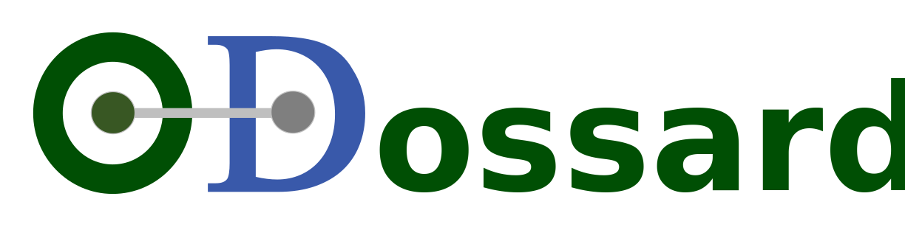

Open Dossard est une application à destination d'organisateurs d'évènement sportifs.
Elle est constituée d'une API et d'un front en ReactJS. Voici une courte <a href="./website/assets/appdemo.gif">démonstration</a> des fonctionnalités de l'outil.

### Installation en mode développement 

```
./od.sh install        # install dependencies
./od.sh start          # start all services
./od.sh stop           # stop all services
```

- Pour accéder à la Webapp : http://localhost:3000
- Pour accéder à l'API du Backend : http://localhost:8080/api

### Installation en mode production 

```
./od.sh goprod        # raise a git pull followed by docker-compose down and up 
```

Attention à bien suivre les étapes d'installation des certificats SSL 

- Une fois les certificats installés : https://app.opendossard.com/ pour l'application
- API : https://app.opendossard.com/api

### Afficher les logs applicatif

```
./od.sh log api
./od.sh log webapp
```

### Base de données Postgres 

Les fichiers d'initialisation de la base (schéma + chargement initial des données) sont situés dans le répertoire `services/api/sql/init`
Il est possible de configurer la base de données manuellement ou automatiquement via :
```
./od.sh installdb
```

### Autre ressources

- [TS Lint configuration](documentation/tslint.md)

