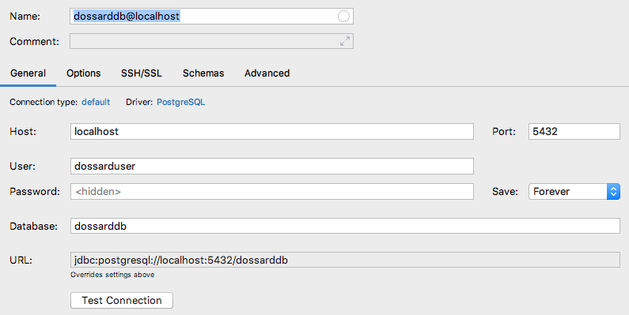

Open Dossard V 0.1  is structured with :
- Services API
- Front React Application

### Quick start in Dev mode

```
./od.sh install        # install dependencies
./od.sh start          # start all services
./od.sh stop           # stop all services
```

- Webapp : http://localhost:3000
- Backend api : http://localhost:8080/api

### Logs

```
./od.sh log api
./od.sh log webapp
```


### Postgres Database : 

Database can be initialised with
```
./cad.sh installdb
```

IntelliJ Settings




### Other resources

- [TS Lint configuration](documentation/tslint.md)

