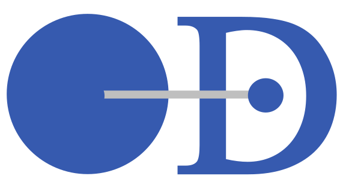
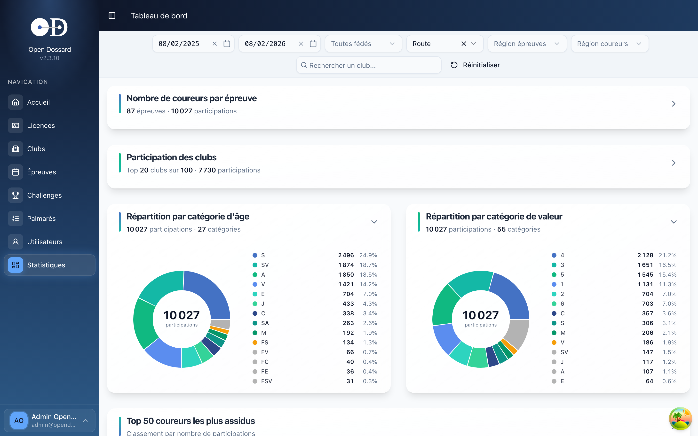
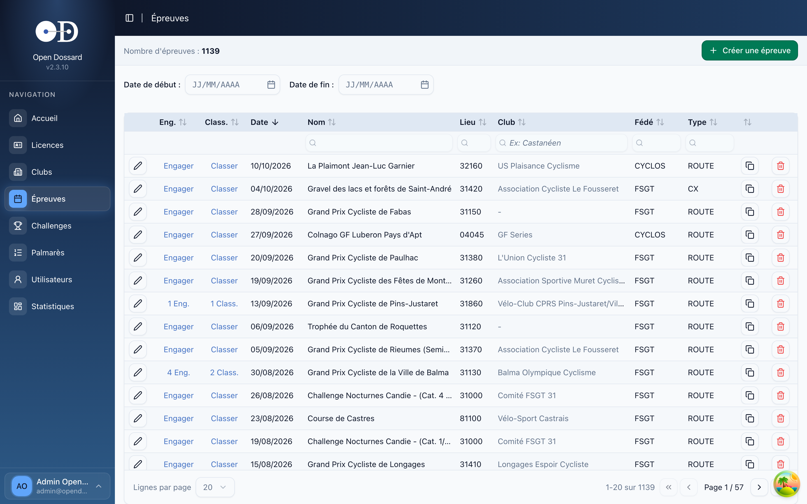
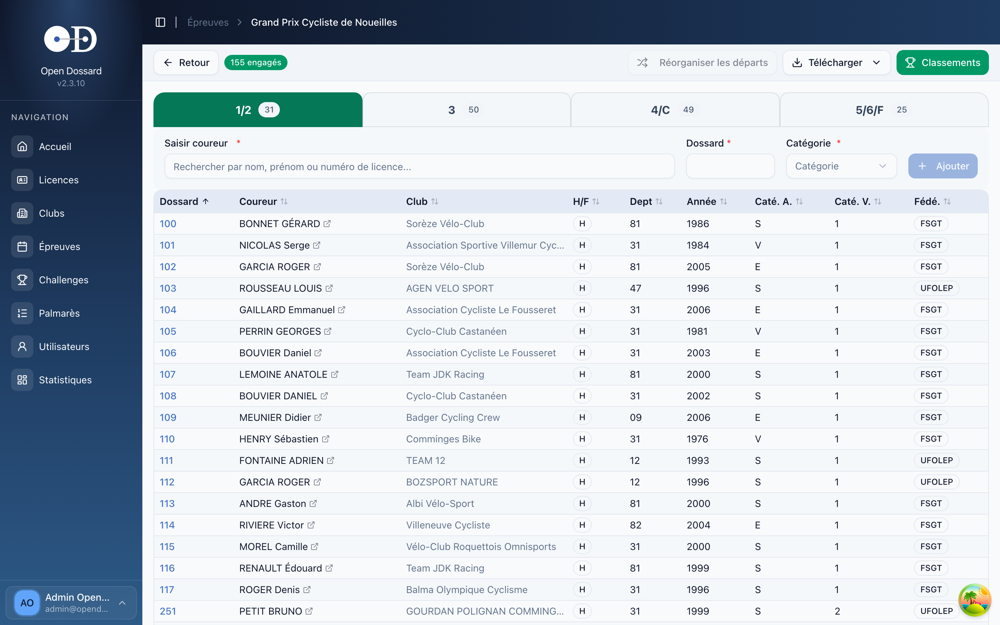
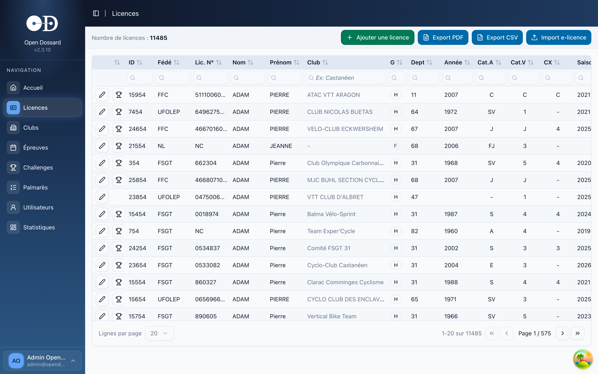
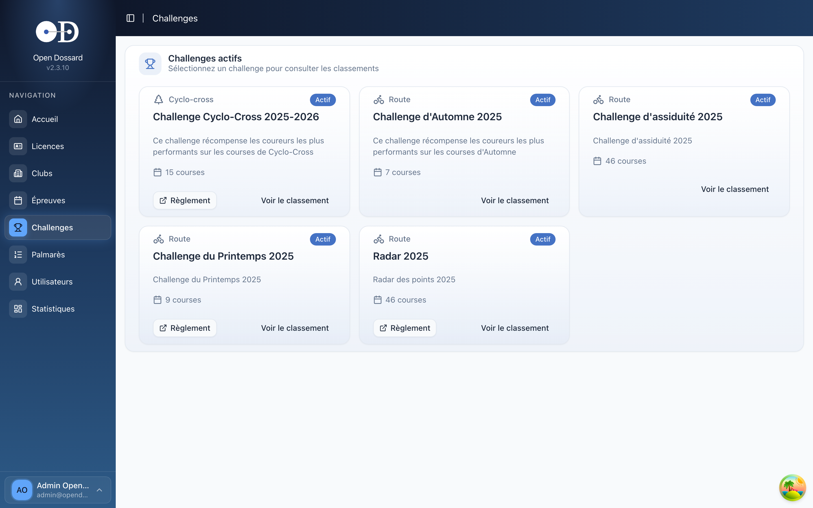

<div align="center">

<picture>
  <source media="(prefers-color-scheme: dark)" srcset="website/assets/images/logoblanc.svg">
  
</picture>

### Le dossard digital pour vos épreuves sportives

Plateforme open source de gestion d'épreuves cyclistes — engagements, résultats, classements et statistiques multi-fédérations.

[**Site web**](https://www.opendossard.com) · [**Contact**](mailto:contact@opendossard.com)


</div>

---

## Sommaire

- [À propos](#à-propos)
- [Aperçu](#aperçu)
- [Fonctionnalités](#fonctionnalités)
- [Stack technique](#stack-technique)
- [Démarrage rapide](#démarrage-rapide)
- [Déploiement](#déploiement)
- [Licence & contact](#licence--contact)

---

## À propos

**Open Dossard** est une application web qui couvre tout le cycle de vie d'une épreuve cycliste — de l'inscription en ligne jusqu'à la publication des classements et palmarès. Elle s'adresse aux **comités**, **clubs** et **organisateurs** qui gèrent plusieurs courses par saison et qui cherchent à professionnaliser leur organisation sans passer par un logiciel propriétaire.

La plateforme gère nativement **plusieurs fédérations** avec leurs catégories, barèmes de points et règles de classement spécifiques.

---

## Aperçu

<div align="center">

<table>
<tr>
<td align="center" width="33%">
<br/>
<sub><b>Tableau de bord</b></sub>
</td>
<td align="center" width="33%">
<br/>
<sub><b>Calendrier des épreuves</b></sub>
</td>
<td align="center" width="33%">
<br/>
<sub><b>Engagements</b></sub>
</td>
</tr>
<tr>
<td align="center" width="33%">
<br/>
<sub><b>Classements</b></sub>
</td>
<td align="center" width="33%">
<br/>
<sub><b>Licences</b></sub>
</td>
<td align="center" width="33%">
<br/>
<sub><b>Challenges & Palmarès</b></sub>
</td>
</tr>
</table>

</div>

---

## Fonctionnalités

### Calendrier & compétitions
Liste complète d'épreuves avec filtres par date, fédération et type. Fiches détaillées multi-onglets (général, horaires, localisation, médias, tarifs), création guidée et duplication pour les épreuves récurrentes. Statistiques de participation pilotables en un clic.

### Engagements
Inscription des coureurs avec autocomplétion sur la base licences. Attribution automatique de la catégorie et du dossard selon les règles de la fédération. Réorganisation drag & drop, inscription multi-courses et import CSV pour traitements en lot.

### Résultats & classements
Saisie type tableur avec auto-complétion par numéro de dossard. Classement automatique par catégorie, âge ou genre. Gestion fine des ex-aequo et abandons (DNF / DSQ). Export PDF et CSV prêts à publier.

### Licences & clubs
Base massive de licenciés multi-fédération avec import CSV. Création de coureurs hors-licence pour les invités, gestion des clubs et des affiliations, édition en masse.

### Challenges & palmarès
Classements inter-épreuves avec barèmes configurables (FSGT 31, cyclo-cross, points, assiduité). Palmarès coureur avec historique, victoires et podiums. Règlements consultables en ligne et exportables.

### Dashboard & statistiques
Graphiques filtrables en temps réel : participation par épreuve, club ou catégorie, assiduité, analyses cross-fédération. Un pilotage d'organisation complet, utilisable en réunion de comité.

---

## Stack technique

### Frontend (`services/webapp-v2`)

- **React 19** + **Vite 7** — UI et bundler moderne
- **TypeScript 5.9** — typage strict
- **Tailwind CSS 4** + **Radix UI** — design system accessible
- **TanStack Query** — cache et synchronisation serveur
- **Zustand** — state management léger
- **React Hook Form** + **Zod** — formulaires validés
- **Recharts** — graphiques du dashboard
- **DnD Kit** — drag & drop des engagements
- **Lexical** — éditeur de texte enrichi
- **PWA** — installable, mode offline partiel

### Backend (`services/api-v2`)

- **NestJS 11** — framework Node.js modulaire
- **TypeORM** + **PostgreSQL 12**
- **Passport / JWT** — auth access + refresh token
- **Swagger / OpenAPI** — documentation API auto-générée
- **class-validator** + **class-transformer** — DTO validés
- **SWC** — compilation rapide

### Infrastructure

- **Docker Compose** pour tous les services
- **Nginx** reverse proxy + TLS (Let's Encrypt)
- **Netdata** monitoring (derrière auth basic)
- **GitHub Container Registry** pour les images
- **GitHub Actions** CI/CD — workflow unifié `deploy-v2.yml` (release + build + test + deploy)

---

## Démarrage rapide

### Prérequis

- Docker et Docker Compose
- Node.js 20+ et pnpm 9+

### Développement local

```bash
# 1. Démarrer la base et l'API en Docker
docker compose -f docker-compose.local-v2.yml up -d dossarddb api-v2

# 2. Démarrer le webapp en dev (hot reload)
cd services/webapp-v2
pnpm install
pnpm dev
```

---

## Déploiement

Les déploiements passent par **GitHub Actions** avec trois inputs :

| Input | Valeurs |
|---|---|
| `envname` | `TEST` · `PREPROD` · `PROD` |
| `release` | `no` · `patch` · `minor` · `major` |
| `branch` | branche à déployer (défaut : `master`) |

La chaîne type d'une release :

```
Release (release-it) → Build & Push (GHCR) → Deploy (SSH, Docker Compose pull/up)
```

En mode `release=no`, les jobs release et build sont skippés et l'image `:latest` existante est simplement redéployée — utile pour propager un correctif de config ou rebasculer un environnement sans bump de version.

---

## Licence & contact

Projet open source sous licence **MIT** maintenu par **DNG Consulting**. Pour toute question, suggestion ou contribution :

- **Contact** : [contact@opendossard.com](mailto:contact@opendossard.com)
- **Site** : [www.opendossard.com](https://www.opendossard.com)

Les pull requests sont les bienvenues.
